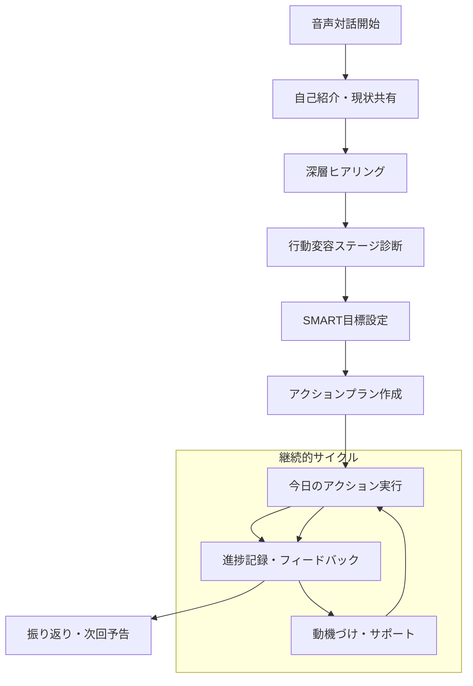

# EVOLVE - Personal Evolution Partner
## 2時間MVP プロダクト要件定義書

## 1. Product Overview

EVOLVEは、最新のコーチング心理学と行動変容理論を統合した革新的なAIパーソナルコーチです。2時間のMVPでは、ユーザーがAIコーチングの核心価値を即座に体験できるよう、音声対話とインテリジェントな情報収集に特化します。

- 2024年最新のNLPコーチング手法（GROWモデル、解決志向コーチング）と5段階行動変容理論を統合したAIエンジン
- Web Speech APIとBytePlus AIによる自然な音声対話で、ユーザーの深層心理と真の目標を引き出す
- 21日間習慣形成理論に基づく科学的アプローチで、持続可能な行動変容をサポート

## 2. Core Features

### 2.1 User Roles
MVPでは単一ユーザーモードで実装。ユーザー登録・ログイン機能は後回し。

### 2.2 Feature Module

2時間MVPの核心機能：
1. **AIコーチング対話ページ**: 音声認識による自然な対話、感情分析、リアルタイムコーチング
2. **インテリジェント情報収集**: 効果的質問技法による深層ヒアリング、行動変容ステージ診断
3. **リアルタイム目標管理**: 即座の目標設定、SMART目標変換、優先度自動調整
4. **基本ダッシュボード**: 進捗可視化、今日のアクション、マイクロ達成システム

### 2.3 Page Details

| Page Name | Module Name | Feature description |
|-----------|-------------|---------------------|
| AIコーチング対話 | 音声認識エンジン | Web Speech API統合、リアルタイム文字起こし、感情検出、音声波形可視化 |
| AIコーチング対話 | 質問生成エンジン | オープンクエスチョン自動生成、5W1H活用、チャンクアップ/ダウン、視点変更質問 |
| AIコーチング対話 | 行動変容分析 | 5段階ステージ診断（無関心→関心→準備→実行→維持）、適応的介入提案 |
| AIコーチング対話 | コーチング応答 | GROWモデル実装、解決志向アプローチ、肯定的質問技法、共感的応答 |
| 情報収集システム | 深層ヒアリング | 30の戦略的質問、価値観探索、現状分析、理想状態設定 |
| 情報収集システム | 心理分析 | 性格特性分析、モチベーション源泉特定、ストレス要因識別 |
| 目標管理 | SMART変換 | 曖昧な目標を具体的・測定可能・達成可能・関連性・期限付きに自動変換 |
| 目標管理 | 優先度算出 | 緊急度・重要度マトリックス、リソース配分、依存関係分析 |
| 目標管理 | アクション分解 | 大目標を実行可能な小ステップに分解、21日間習慣形成計画 |
| ダッシュボード | 進捗可視化 | リアルタイム進捗バー、達成度グラフ、成長曲線表示 |
| ダッシュボード | マイクロ達成 | 小さな成功の即座フィードバック、ポジティブ強化、継続動機維持 |
| ダッシュボード | 今日のアクション | AI推奨の具体的行動、実行時間見積もり、完了チェック |

## 3. Core Process

### 2時間MVP ユーザージャーニー

**Phase 1: 初回接触（10分）**
1. 直接AIコーチング対話ページにアクセス
2. 音声での自己紹介と現状共有
3. AIによる初期分析と共感的応答

**Phase 2: 深層ヒアリング（30分）**
1. 戦略的質問による価値観探索
2. 現在の課題と理想状態の明確化
3. 行動変容ステージの診断

**Phase 3: 目標設定（20分）**
1. 抽出された情報からSMART目標自動生成
2. 優先度と実現可能性の調整
3. 21日間アクションプラン作成

**Phase 4: 実行支援（50分）**
1. 今日から始められる具体的アクション提示
2. 進捗記録とリアルタイムフィードバック
3. 継続のための動機づけとサポート

**Phase 5: 振り返り（10分）**
1. セッション全体の振り返り
2. 学びと気づきの整理
3. 次回セッションの予告

## 4. User Interface Design

### 4.1 Design Style

- **Primary Colors**: Calm Blue (#3B82F6) - 信頼と安心感
- **Secondary Colors**: Growth Green (#10B981) - 成長と希望
- **Accent Colors**: Energy Orange (#F59E0B) - 活力と行動
- **Background**: Soft White (#FAFAFA) - 清潔感と集中
- **Button Style**: 丸角（12px）、グラデーション、マイクロインタラクション
- **Typography**: Inter（英語）、Noto Sans JP（日本語）、階層的サイズ設計
- **Layout Style**: シンプル・ミニマル、音声中心設計、直感的操作
- **Animation**: Framer Motion、音声波形、進捗アニメーション

### 4.2 Page Design Overview

| Page Name | Module Name | UI Elements |
|-----------|-------------|-------------|
| AIコーチング対話 | 音声インターフェース | 中央大型マイクボタン（120px）、音声波形リアルタイム表示、感情インジケーター |
| AIコーチング対話 | 対話表示エリア | チャット形式、音声文字起こし、AI応答、感情分析結果表示 |
| AIコーチング対話 | コントロールパネル | 録音開始/停止、音量調整、言語設定、緊急停止ボタン |
| 目標管理 | 目標カード | ドラッグ可能、進捗バー、優先度ラベル、編集ボタン |
| 目標管理 | アクション分解 | ツリー構造表示、チェックボックス、期限表示、難易度インジケーター |
| ダッシュボード | 進捗サマリー | 円形進捗グラフ、達成率表示、今週の成果、次のマイルストーン |
| ダッシュボード | 今日のアクション | カード形式、実行時間、完了チェック、AI推奨理由 |

### 4.3 Responsiveness

- **Desktop First**: 1200px基準、フル機能音声インターフェース
- **Mobile Optimized**: 375px対応、タッチ最適化、音声中心操作
- **Progressive Web App**: オフライン対応、プッシュ通知、ホーム画面追加

## 5. 最新コーチング手法統合

### 5.1 NLPコーチング技法

**GROWモデル実装**
- Goal（目標）: 「理想の状態を具体的に教えてください」
- Reality（現実）: 「現在の状況はどうですか？」
- Options（選択肢）: 「どんな方法が考えられますか？」
- Will（意志）: 「具体的に何を実行しますか？」

**効果的質問技法**
- オープンクエスチョン: 「どのように感じていますか？」
- チャンクアップ: 「それはあなたにとってどんな意味がありますか？」
- チャンクダウン: 「具体的にはどんなステップが必要ですか？」
- 視点変更: 「もし制約がなかったら、どうしたいですか？」

### 5.2 行動変容5段階理論

**無関心期（Precontemplation）**
- 問題認識の促進: 「現状維持のリスクは何ですか？」
- 動機づけ情報提供: 成功事例、メリット可視化

**関心期（Contemplation）**
- 両面性探索: メリット・デメリット分析
- 自己効力感向上: 「過去の成功体験は？」

**準備期（Preparation）**
- 具体的計画立案: 行動ステップ詳細化
- 環境整備: 障害除去、サポート体制

**実行期（Action）**
- 継続支援: 日々のフィードバック
- 挫折予防: 代替行動、ストレス管理

**維持期（Maintenance）**
- 習慣化支援: 21日間継続追跡
- 再発防止: トリガー管理、対処法

### 5.3 21日間習慣形成理論

**Week 1: 意識的実行期**
- 毎日のリマインダー
- 実行記録と即座フィードバック
- 小さな成功の積み重ね

**Week 2: 抵抗期**
- モチベーション維持支援
- 障害対処法提供
- 社会的サポート活用

**Week 3: 習慣化期**
- 自動化促進
- 長期継続戦略
- 次の習慣への準備

## 6. AI コーチング エンジン仕様

### 6.1 感情知能統合

**感情認識**
- 音声感情分析: 声のトーン、速度、間
- 言語感情分析: 単語選択、表現パターン
- 文脈感情理解: 状況、背景、関係性

**共感的応答**
- 感情の反映: 「〜と感じていらっしゃるのですね」
- 感情の正常化: 「そう感じるのは自然なことです」
- 感情の探索: 「その感情の背景には何がありますか？」

### 6.2 適応的質問生成

**ユーザー状態適応**
- エネルギーレベル: 高→挑戦的質問、低→支援的質問
- 感情状態: ポジティブ→拡張質問、ネガティブ→安定化質問
- 進捗状況: 順調→加速質問、停滞→見直し質問

**質問深度調整**
- 表面レベル: 事実確認、現状把握
- 中間レベル: 感情探索、価値観確認
- 深層レベル: 信念体系、人生観、存在意義

### 6.3 行動変容促進機能

**マイクロ達成システム**
- 小さな成功の即座認識
- ポジティブ強化フィードバック
- 成長実感の可視化

**適応的介入**
- リアルタイム状況判断
- 個別最適化されたサポート
- 予防的介入とリスク管理