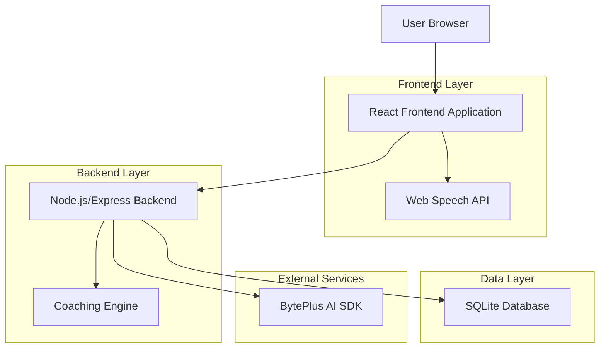
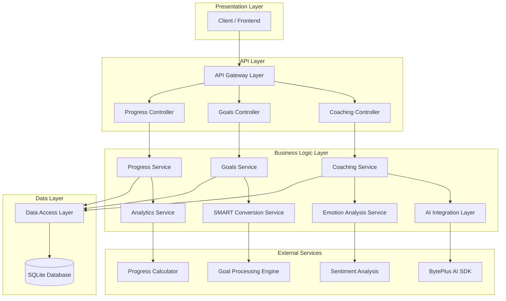
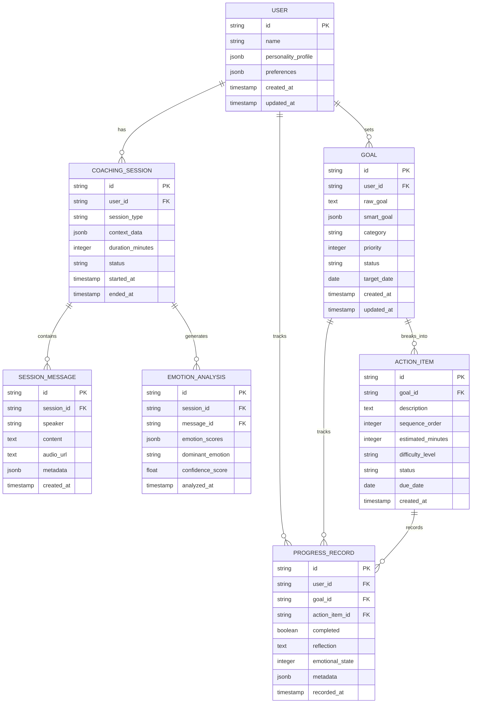

# EVOLVE - Personal Evolution Partner
## 2時間MVP 技術アーキテクチャ設計書

## 1. Architecture Design



## 2. Technology Description

- **Frontend**: React@18 + TypeScript + Vite + TailwindCSS + Framer Motion
- **Backend**: Node.js@20 + Express@4 + TypeScript
- **Database**: SQLite (開発用) → PostgreSQL (本番用)
- **AI Services**: BytePlus AI SDK + Web Speech API
- **Real-time**: WebSocket (Socket.io)
- **State Management**: Zustand
- **Audio Processing**: Web Audio API

## 3. Route Definitions

| Route | Purpose |
|-------|---------|
| `/` | AIコーチング対話ページ（メイン画面） |
| `/coach` | 音声対話インターフェース |
| `/goals` | リアルタイム目標管理 |
| `/dashboard` | 基本ダッシュボード・進捗表示 |
| `/session/:id` | 特定セッションの詳細表示 |

## 4. API Definitions

### 4.1 Core API

**音声コーチングセッション開始**
```
POST /api/coaching/session/start
```

Request:
| Param Name | Param Type | isRequired | Description |
|------------|------------|------------|-------------|
| audioData | Blob | false | 音声データ（オプション） |
| textInput | string | false | テキスト入力（音声の代替） |
| sessionContext | object | false | セッション文脈情報 |

Response:
| Param Name | Param Type | Description |
|------------|------------|-------------|
| sessionId | string | セッション識別子 |
| aiResponse | string | AIコーチの応答 |
| emotionAnalysis | object | 感情分析結果 |
| nextQuestions | array | 推奨次質問リスト |

**リアルタイム音声処理**
```
WebSocket /ws/coaching
```

Events:
- `audio_chunk`: 音声データストリーム
- `transcription`: リアルタイム文字起こし
- `ai_response`: AI応答ストリーム
- `emotion_update`: 感情状態更新

**目標管理**
```
POST /api/goals/create
PUT /api/goals/:id/update
GET /api/goals/list
```

Request (Create):
| Param Name | Param Type | isRequired | Description |
|------------|------------|------------|-------------|
| rawGoal | string | true | ユーザーの生の目標表現 |
| priority | number | false | 優先度（1-5） |
| category | string | false | カテゴリ |

Response:
| Param Name | Param Type | Description |
|------------|------------|-------------|
| goalId | string | 目標識別子 |
| smartGoal | object | SMART変換された目標 |
| actionPlan | array | 21日間アクションプラン |
| milestones | array | マイルストーン |

**進捗追跡**
```
POST /api/progress/update
GET /api/progress/dashboard
```

Request:
| Param Name | Param Type | isRequired | Description |
|------------|------------|------------|-------------|
| goalId | string | true | 目標識別子 |
| actionCompleted | boolean | true | アクション完了状況 |
| reflection | string | false | 振り返りコメント |
| emotionalState | number | false | 感情状態（1-10） |

Response:
| Param Name | Param Type | Description |
|------------|------------|-------------|
| progressUpdate | object | 進捗更新結果 |
| achievements | array | 達成した成果 |
| nextActions | array | 次の推奨アクション |
| motivationalMessage | string | 動機づけメッセージ |

## 5. Server Architecture Diagram



## 6. Data Model

### 6.1 Data Model Definition



### 6.2 Data Definition Language

**User Table (users)**
```sql
-- ユーザーテーブル
CREATE TABLE users (
    id TEXT PRIMARY KEY DEFAULT (lower(hex(randomblob(16)))),
    name TEXT NOT NULL,
    personality_profile TEXT DEFAULT '{}',
    preferences TEXT DEFAULT '{}',
    created_at DATETIME DEFAULT CURRENT_TIMESTAMP,
    updated_at DATETIME DEFAULT CURRENT_TIMESTAMP
);

-- インデックス
CREATE INDEX idx_users_created_at ON users(created_at);
```

**Coaching Session Table (coaching_sessions)**
```sql
-- コーチングセッションテーブル
CREATE TABLE coaching_sessions (
    id TEXT PRIMARY KEY DEFAULT (lower(hex(randomblob(16)))),
    user_id TEXT NOT NULL,
    session_type TEXT DEFAULT 'general',
    context_data TEXT DEFAULT '{}',
    duration_minutes INTEGER DEFAULT 0,
    status TEXT DEFAULT 'active' CHECK (status IN ('active', 'completed', 'paused')),
    started_at DATETIME DEFAULT CURRENT_TIMESTAMP,
    ended_at DATETIME,
    FOREIGN KEY (user_id) REFERENCES users(id)
);

-- インデックス
CREATE INDEX idx_sessions_user_id ON coaching_sessions(user_id);
CREATE INDEX idx_sessions_started_at ON coaching_sessions(started_at DESC);
CREATE INDEX idx_sessions_status ON coaching_sessions(status);
```

**Session Messages Table (session_messages)**
```sql
-- セッションメッセージテーブル
CREATE TABLE session_messages (
    id TEXT PRIMARY KEY DEFAULT (lower(hex(randomblob(16)))),
    session_id TEXT NOT NULL,
    speaker TEXT NOT NULL CHECK (speaker IN ('user', 'ai')),
    content TEXT NOT NULL,
    audio_url TEXT,
    metadata TEXT DEFAULT '{}',
    created_at DATETIME DEFAULT CURRENT_TIMESTAMP,
    FOREIGN KEY (session_id) REFERENCES coaching_sessions(id)
);

-- インデックス
CREATE INDEX idx_messages_session_id ON session_messages(session_id);
CREATE INDEX idx_messages_created_at ON session_messages(created_at);
```

**Emotion Analysis Table (emotion_analysis)**
```sql
-- 感情分析テーブル
CREATE TABLE emotion_analysis (
    id TEXT PRIMARY KEY DEFAULT (lower(hex(randomblob(16)))),
    session_id TEXT NOT NULL,
    message_id TEXT NOT NULL,
    emotion_scores TEXT DEFAULT '{}',
    dominant_emotion TEXT,
    confidence_score REAL DEFAULT 0.0,
    analyzed_at DATETIME DEFAULT CURRENT_TIMESTAMP,
    FOREIGN KEY (session_id) REFERENCES coaching_sessions(id),
    FOREIGN KEY (message_id) REFERENCES session_messages(id)
);

-- インデックス
CREATE INDEX idx_emotion_session_id ON emotion_analysis(session_id);
CREATE INDEX idx_emotion_analyzed_at ON emotion_analysis(analyzed_at DESC);
```

**Goals Table (goals)**
```sql
-- 目標テーブル
CREATE TABLE goals (
    id TEXT PRIMARY KEY DEFAULT (lower(hex(randomblob(16)))),
    user_id TEXT NOT NULL,
    raw_goal TEXT NOT NULL,
    smart_goal TEXT DEFAULT '{}',
    category TEXT DEFAULT 'general',
    priority INTEGER DEFAULT 3 CHECK (priority BETWEEN 1 AND 5),
    status TEXT DEFAULT 'active' CHECK (status IN ('active', 'completed', 'paused', 'cancelled')),
    target_date DATE,
    created_at DATETIME DEFAULT CURRENT_TIMESTAMP,
    updated_at DATETIME DEFAULT CURRENT_TIMESTAMP,
    FOREIGN KEY (user_id) REFERENCES users(id)
);

-- インデックス
CREATE INDEX idx_goals_user_id ON goals(user_id);
CREATE INDEX idx_goals_status ON goals(status);
CREATE INDEX idx_goals_priority ON goals(priority DESC);
CREATE INDEX idx_goals_target_date ON goals(target_date);
```

**Action Items Table (action_items)**
```sql
-- アクションアイテムテーブル
CREATE TABLE action_items (
    id TEXT PRIMARY KEY DEFAULT (lower(hex(randomblob(16)))),
    goal_id TEXT NOT NULL,
    description TEXT NOT NULL,
    sequence_order INTEGER DEFAULT 0,
    estimated_minutes INTEGER DEFAULT 30,
    difficulty_level TEXT DEFAULT 'medium' CHECK (difficulty_level IN ('easy', 'medium', 'hard')),
    status TEXT DEFAULT 'pending' CHECK (status IN ('pending', 'in_progress', 'completed', 'skipped')),
    due_date DATE,
    created_at DATETIME DEFAULT CURRENT_TIMESTAMP,
    FOREIGN KEY (goal_id) REFERENCES goals(id)
);

-- インデックス
CREATE INDEX idx_actions_goal_id ON action_items(goal_id);
CREATE INDEX idx_actions_status ON action_items(status);
CREATE INDEX idx_actions_due_date ON action_items(due_date);
CREATE INDEX idx_actions_sequence ON action_items(sequence_order);
```

**Progress Records Table (progress_records)**
```sql
-- 進捗記録テーブル
CREATE TABLE progress_records (
    id TEXT PRIMARY KEY DEFAULT (lower(hex(randomblob(16)))),
    user_id TEXT NOT NULL,
    goal_id TEXT,
    action_item_id TEXT,
    completed BOOLEAN DEFAULT FALSE,
    reflection TEXT,
    emotional_state INTEGER CHECK (emotional_state BETWEEN 1 AND 10),
    metadata TEXT DEFAULT '{}',
    recorded_at DATETIME DEFAULT CURRENT_TIMESTAMP,
    FOREIGN KEY (user_id) REFERENCES users(id),
    FOREIGN KEY (goal_id) REFERENCES goals(id),
    FOREIGN KEY (action_item_id) REFERENCES action_items(id)
);

-- インデックス
CREATE INDEX idx_progress_user_id ON progress_records(user_id);
CREATE INDEX idx_progress_goal_id ON progress_records(goal_id);
CREATE INDEX idx_progress_recorded_at ON progress_records(recorded_at DESC);
CREATE INDEX idx_progress_completed ON progress_records(completed);
```

**初期データ挿入**
```sql
-- サンプルユーザー
INSERT INTO users (id, name, personality_profile, preferences) VALUES 
('demo-user-001', 'Demo User', 
 '{"openness": 0.8, "conscientiousness": 0.7, "extraversion": 0.6, "agreeableness": 0.9, "neuroticism": 0.3}',
 '{"coaching_style": "supportive", "session_length": 30, "reminder_frequency": "daily"}');

-- サンプル目標
INSERT INTO goals (id, user_id, raw_goal, smart_goal, category, priority, target_date) VALUES 
('demo-goal-001', 'demo-user-001', 
 '健康的な生活習慣を身につけたい',
 '{"specific": "毎日30分の運動と8時間の睡眠", "measurable": "週5日以上実行", "achievable": "段階的に習慣化", "relevant": "健康改善", "timebound": "21日間"}',
 'health', 5, date('now', '+21 days'));

-- サンプルアクションアイテム
INSERT INTO action_items (goal_id, description, sequence_order, estimated_minutes, difficulty_level, due_date) VALUES 
('demo-goal-001', '朝の10分ストレッチ', 1, 10, 'easy', date('now', '+1 day')),
('demo-goal-001', '夜23時までにベッドに入る', 2, 5, 'medium', date('now', '+1 day')),
('demo-goal-001', '水を1日2リットル飲む', 3, 2, 'easy', date('now', '+1 day'));
```

## 7. 2時間MVP 開発優先順位

### Phase 1: 基盤構築（30分）
1. React + Vite プロジェクト初期化
2. SQLite データベース設定
3. Express サーバー基本構造
4. Web Speech API 統合

### Phase 2: コア機能（60分）
1. 音声認識・文字起こし機能
2. BytePlus AI 統合
3. 基本的なコーチング応答システム
4. リアルタイム対話インターフェース

### Phase 3: 目標管理（20分）
1. 簡易目標入力・表示
2. SMART変換基本ロジック
3. 進捗記録機能

### Phase 4: ダッシュボード（10分）
1. 基本進捗表示
2. 今日のアクション表示
3. 簡易分析レポート

## 8. セキュリティ・パフォーマンス考慮事項

### セキュリティ
- 音声データの一時的保存のみ（永続化なし）
- API レート制限実装
- 入力データサニタイゼーション
- CORS 適切設定

### パフォーマンス
- 音声データストリーミング最適化
- AI応答キャッシュ機能
- データベースクエリ最適化
- フロントエンド遅延読み込み