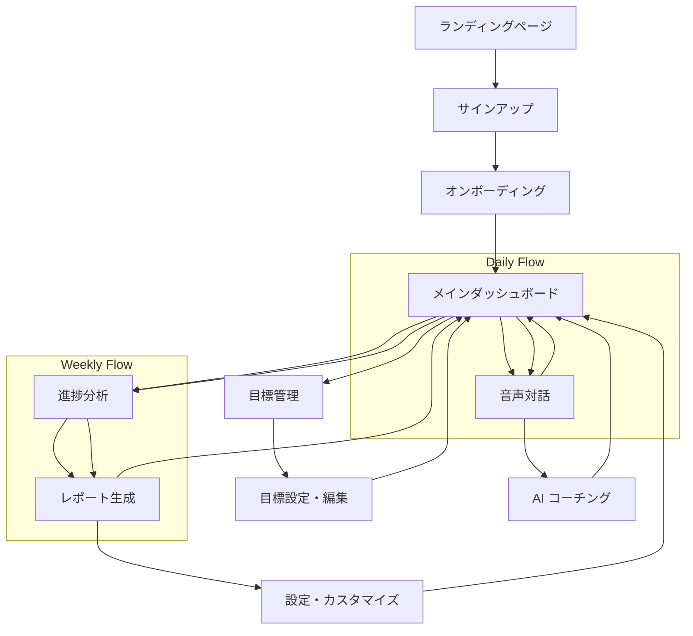

# EVOLVE - Personal Evolution Partner
## プロダクト要件定義書

## 1. Product Overview

EVOLVEは、BytePlusのAI技術を活用した次世代パーソナルコーチングWebアプリケーションです。複数の人生目標を同時並行で管理し、音声認識による自然な対話と3D可視化による美しい進捗表示を通じて、ユーザーの継続的な成長をサポートします。

- 科学的データ分析に基づく個人最適化により、従来のコーチングアプリでは実現できない深いパーソナライゼーションを提供
- 音声中心のインターフェースにより、忙しい現代人でも日常的に利用可能な革新的なユーザー体験を実現
- 個人の成長と社会全体のウェルビーイング向上を目指し、1年後には10万人のアクティブユーザーによる成長コミュニティの構築を目標とする

## 2. Core Features

### 2.1 User Roles

| Role | Registration Method | Core Permissions |
|------|---------------------|------------------|
| Free User | Email registration | 基本的な目標設定、週次レポート、音声対話（月10時間まで） |
| Premium User | 月額サブスクリプション | 無制限音声対話、3D可視化、予測分析、カスタムコーチングスタイル |
| Enterprise User | 企業契約 | チーム管理、組織分析、管理者ダッシュボード、API アクセス |

### 2.2 Feature Module

EVOLVEの要件は以下の主要ページで構成されます：

1. **ランディングページ**: ヒーローセクション、デモ動画、機能紹介、価格プラン
2. **認証ページ**: ユーザー登録、ログイン、パスワードリセット
3. **オンボーディングページ**: 初回30分深層分析、目標設定ウィザード、パーソナライゼーション
4. **メインダッシュボード**: 3D人生建設ビュー、進捗概要、今日のアクション、音声対話エントリー
5. **目標管理ページ**: 複数目標設定、依存関係分析、優先度調整、リソース配分
6. **音声対話ページ**: リアルタイム音声認識、AI コーチング、感情分析、アドバイス生成
7. **進捗分析ページ**: 詳細グラフ、予測分析、相関分析、成長パターン可視化
8. **レポートページ**: 週次・月次・年次レポート、成果サマリー、次期目標提案
9. **設定ページ**: プロフィール管理、プライバシー設定、通知設定、コーチングスタイル調整

### 2.3 Page Details

| Page Name | Module Name | Feature description |
|-----------|-------------|---------------------|
| ランディングページ | ヒーローセクション | 魅力的なキャッチコピー、デモ動画自動再生、CTA ボタン配置 |
| ランディングページ | 機能紹介セクション | 3つの核心価値提案、ユーザー証言、Before/After 比較 |
| ランディングページ | 価格プランセクション | Free/Premium/Enterprise プラン比較、14日間無料トライアル |
| 認証ページ | ユーザー登録 | Email/Google/Apple サインアップ、プライバシー同意、メール認証 |
| 認証ページ | ログイン | 認証情報入力、Remember me、パスワードリセットリンク |
| オンボーディングページ | 深層分析ウィザード | 30分間の質問セッション、音声録音、性格分析、現状把握 |
| オンボーディングページ | 目標設定ウィザード | SMART目標設定、優先度設定、期限設定、成功指標定義 |
| メインダッシュボード | 3D人生建設ビュー | Three.js による3D可視化、目標を建物として表現、進捗をアニメーション表示 |
| メインダッシュボード | 今日のアクション | AI推奨アクション、優先度表示、完了チェック、時間見積もり |
| メインダッシュボード | 音声対話エントリー | ワンクリック音声開始、リアルタイム音声認識、感情検出 |
| 目標管理ページ | 複数目標管理 | ドラッグ&ドロップ目標編集、依存関係可視化、リソース配分調整 |
| 目標管理ページ | 動的優先度調整 | AI による優先度提案、ライフイベント考慮、緊急度マトリックス |
| 音声対話ページ | リアルタイム対話 | Web Speech API、感情分析、コンテキスト理解、自然言語処理 |
| 音声対話ページ | AI コーチング | BytePlus AI統合、パーソナライズドアドバイス、適応的質問生成 |
| 進捗分析ページ | 詳細可視化 | Chart.js グラフ、相関分析、トレンド予測、パフォーマンス指標 |
| 進捗分析ページ | 予測分析 | 機械学習による成果予測、リスク分析、最適化提案 |
| レポートページ | 成長レポート | 週次・月次・年次サマリー、達成度分析、次期目標提案 |
| レポートページ | 共有機能 | PDF エクスポート、SNS 共有、プライバシー保護共有 |
| 設定ページ | プロフィール管理 | 個人情報編集、アバター設定、プライバシー設定 |
| 設定ページ | コーチングカスタマイズ | コーチングスタイル選択、フィードバック頻度、通知設定 |

## 3. Core Process

### Free User Flow
1. ランディングページでデモ動画視聴 → 興味喚起
2. 簡単サインアップ（3ステップ） → アカウント作成
3. 基本オンボーディング（15分） → 初期設定
4. 基本ダッシュボード利用 → 機能体験
5. 制限付き音声対話 → 価値実感
6. Premium アップグレード検討 → 継続利用

### Premium User Flow
1. 14日間無料トライアル開始 → フル機能体験
2. 完全オンボーディング（30分） → 深層分析
3. 複数目標設定 → 人生設計
4. 日常音声対話（朝夕5-10分） → 習慣形成
5. 3D可視化で進捗確認 → 成長実感
6. 週次レポートで振り返り → 継続改善

### Enterprise User Flow
1. 企業担当者による導入相談 → カスタマイズ提案
2. チーム管理者設定 → 組織構造構築
3. 従業員一括招待 → チーム参加
4. 組織目標と個人目標連携 → 統合管理
5. 管理者ダッシュボードで進捗監視 → 組織最適化

## 4. User Interface Design

### 4.1 Design Style

- **Primary Colors**: Deep Blue (#1E3A8A) - 信頼性と安定性を表現
- **Secondary Colors**: Vibrant Green (#10B981) - 成長と進歩を象徴
- **Accent Colors**: Warm Orange (#F59E0B) - エネルギーと活力
- **Neutral Colors**: Cool Gray (#6B7280) - バランスと落ち着き
- **Button Style**: 丸角ボタン（border-radius: 12px）、グラデーション効果、ホバーアニメーション
- **Typography**: Inter フォント（Primary）、Noto Sans JP（日本語）、サイズ階層（14px/16px/20px/24px/32px）
- **Layout Style**: カードベースデザイン、グリッドレイアウト、フローティングアクション、サイドナビゲーション
- **Icon Style**: Heroicons（アウトライン）、カスタム3Dアイコン、アニメーション対応

### 4.2 Page Design Overview

| Page Name | Module Name | UI Elements |
|-----------|-------------|-------------|
| ランディングページ | ヒーローセクション | フルスクリーン背景動画、中央配置タイトル（32px Bold）、グラデーションCTAボタン、スクロールインジケーター |
| ランディングページ | 機能紹介 | 3カラムカードレイアウト、アイコン + タイトル + 説明、ホバーエフェクト、パララックススクロール |
| メインダッシュボード | 3D可視化エリア | Three.js キャンバス（60%幅）、インタラクティブ3Dモデル、リアルタイムアニメーション、コントロールパネル |
| メインダッシュボード | サイドパネル | 固定サイドバー（300px）、今日のアクション、進捗サマリー、クイックアクセスボタン |
| 音声対話ページ | 音声インターフェース | 中央配置マイクボタン（120px）、音声波形可視化、リアルタイム文字起こし、感情インジケーター |
| 進捗分析ページ | グラフエリア | レスポンシブChart.js、ダークモード対応、インタラクティブツールチップ、データフィルター |
| 目標管理ページ | 目標カード | ドラッグ可能カード、進捗バー、優先度ラベル、アクションボタン、依存関係線 |

### 4.3 Responsiveness

- **Desktop First**: 1920px基準設計、フル機能3Dダッシュボード、マルチカラムレイアウト
- **Tablet Adaptive**: 768px-1024px、タッチ最適化、2カラムレイアウト、ジェスチャー対応
- **Mobile Optimized**: 375px-768px、音声中心インターフェース、シングルカラム、PWA対応
- **Touch Interaction**: 44px最小タッチターゲット、スワイプナビゲーション、ピンチズーム対応
- **Progressive Enhancement**: 基本機能→高度機能の段階的提供、オフライン対応、Service Worker活用