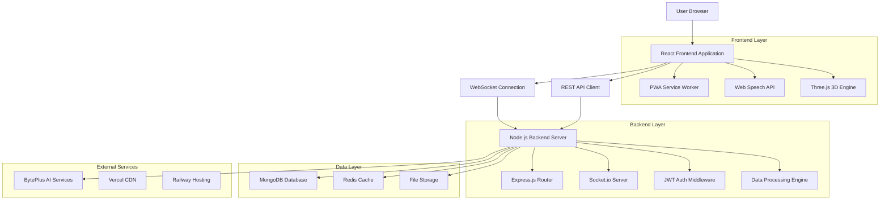
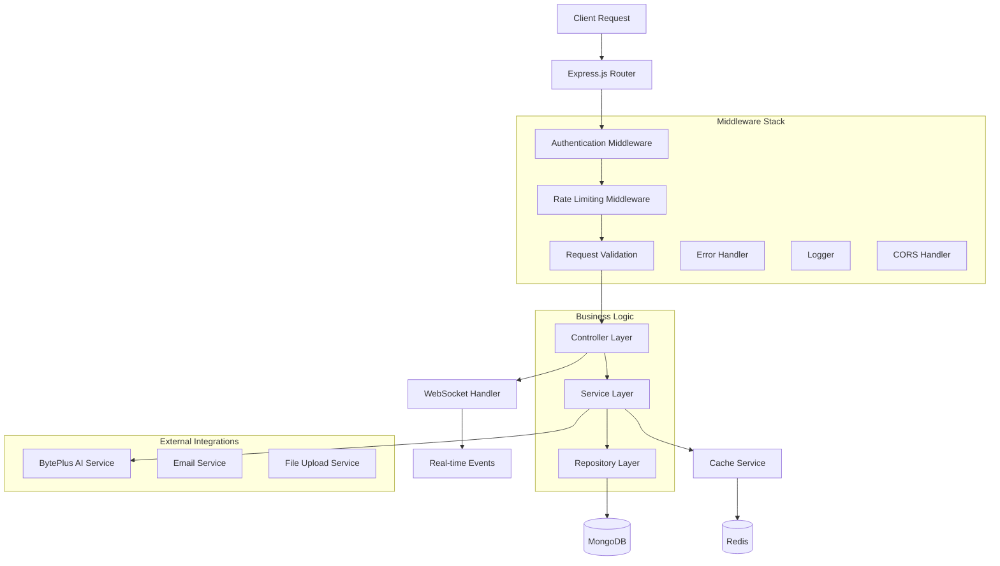
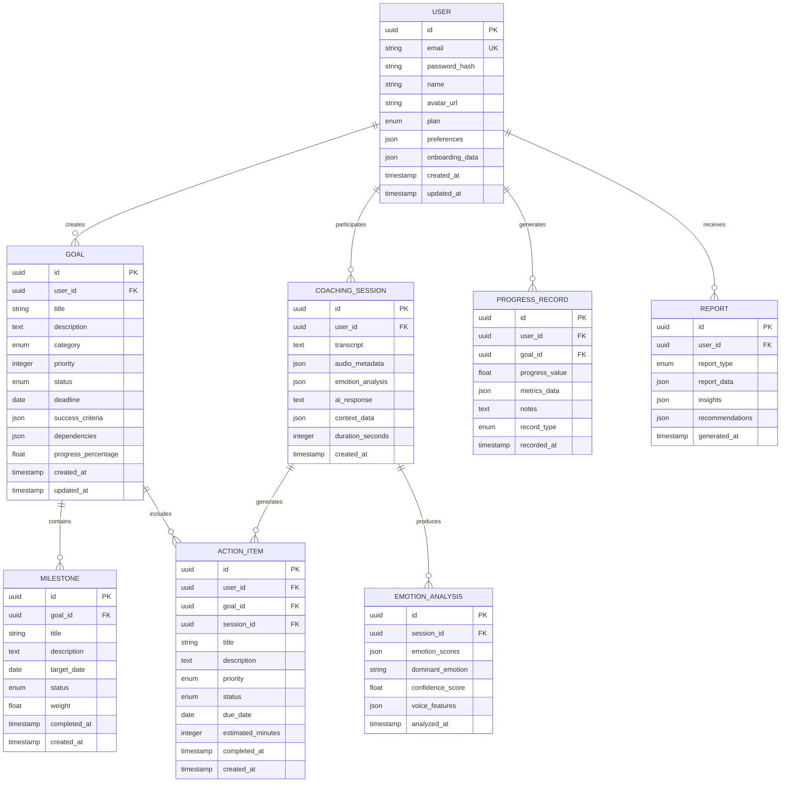

# EVOLVE - Personal Evolution Partner

## 技術アーキテクチャ文書

## 1. Architecture design



## 2. Technology Description

* **Frontend**: React\@18 + TypeScript + Vite + Tailwind CSS + Framer Motion + Three.js + Chart.js + Zustand

* **Backend**: Node.js\@18 + Express\@4 + Socket.io + JWT + TypeScript

* **Database**: MongoDB Atlas + Mongoose + Redis Cloud

* **AI Integration**: BytePlus SDK + Web Speech API

* **Deployment**: Vercel (Frontend) + Railway (Backend) + GitHub Actions (CI/CD)

## 3. Route definitions

| Route        | Purpose                        |
| ------------ | ------------------------------ |
| /            | ランディングページ、プロダクト紹介とサインアップ誘導     |
| /auth/signup | ユーザー登録ページ、Email/Google/Apple認証 |
| /auth/login  | ログインページ、認証情報入力とセッション開始         |
| /auth/reset  | パスワードリセットページ、メール認証フロー          |
| /onboarding  | 初回オンボーディング、30分深層分析セッション        |
| /dashboard   | メインダッシュボード、3D可視化と今日のアクション      |
| /goals       | 目標管理ページ、複数目標設定と依存関係管理          |
| /coach       | 音声対話ページ、AI コーチングとリアルタイム分析      |
| /analytics   | 進捗分析ページ、詳細グラフと予測分析             |
| /reports     | レポートページ、週次・月次・年次成長レポート         |
| /settings    | 設定ページ、プロフィール管理とプライバシー設定        |
| /premium     | プレミアムプランページ、機能比較とアップグレード       |

## 4. API definitions

### 4.1 Core API

#### User Authentication

```
POST /api/auth/register
```

Request:

| Param Name | Param Type | isRequired | Description                |
| ---------- | ---------- | ---------- | -------------------------- |
| email      | string     | true       | ユーザーのメールアドレス               |
| password   | string     | true       | パスワード（8文字以上）               |
| name       | string     | true       | ユーザーの表示名                   |
| provider   | string     | false      | OAuth プロバイダー（google/apple） |

Response:

| Param Name   | Param Type | Description  |
| ------------ | ---------- | ------------ |
| success      | boolean    | 登録成功フラグ      |
| user         | User       | ユーザー情報オブジェクト |
| accessToken  | string     | JWT アクセストークン |
| refreshToken | string     | リフレッシュトークン   |

Example:

```json
{
  "email": "user@example.com",
  "password": "securePassword123",
  "name": "田中太郎"
}
```

#### Goal Management

```
POST /api/goals
```

Request:

| Param Name  | Param Type   | isRequired | Description                             |
| ----------- | ------------ | ---------- | --------------------------------------- |
| title       | string       | true       | 目標のタイトル                                 |
| description | string       | false      | 目標の詳細説明                                 |
| category    | string       | true       | カテゴリー（career/health/personal/financial） |
| priority    | number       | true       | 優先度（1-5）                                |
| deadline    | Date         | true       | 目標達成期限                                  |
| milestones  | Milestone\[] | false      | マイルストーン配列                               |

Response:

| Param Name  | Param Type | Description   |
| ----------- | ---------- | ------------- |
| success     | boolean    | 作成成功フラグ       |
| goal        | Goal       | 作成された目標オブジェクト |
| suggestions | string\[]  | AI による関連提案    |

#### Voice Coaching Session

```
POST /api/coaching/session
```

Request:

| Param Name | Param Type | isRequired | Description                       |
| ---------- | ---------- | ---------- | --------------------------------- |
| audioData  | Blob       | true       | 音声データ（WebM形式）                     |
| context    | string     | false      | セッションコンテキスト                       |
| mood       | string     | false      | 現在の気分（happy/neutral/stressed/sad） |
| goals      | string\[]  | false      | 関連する目標ID配列                        |

Response:

| Param Name  | Param Type       | Description   |
| ----------- | ---------------- | ------------- |
| success     | boolean          | 処理成功フラグ       |
| transcript  | string           | 音声の文字起こし      |
| analysis    | EmotionAnalysis  | 感情分析結果        |
| coaching    | CoachingResponse | AI コーチングレスポンス |
| actionItems | ActionItem\[]    | 推奨アクション配列     |

#### Progress Analytics

```
GET /api/analytics/progress
```

Request:

| Param Name | Param Type | isRequired | Description                   |
| ---------- | ---------- | ---------- | ----------------------------- |
| period     | string     | true       | 分析期間（week/month/quarter/year） |
| goalIds    | string\[]  | false      | 特定目標のID配列                     |
| metrics    | string\[]  | false      | 取得メトリクス配列                     |

Response:

| Param Name  | Param Type    | Description |
| ----------- | ------------- | ----------- |
| success     | boolean       | 取得成功フラグ     |
| data        | AnalyticsData | 分析データオブジェクト |
| insights    | Insight\[]    | AI による洞察配列  |
| predictions | Prediction\[] | 成果予測配列      |

## 5. Server architecture diagram



## 6. Data model

### 6.1 Data model definition



### 6.2 Data Definition Language

#### User Table (users)

```sql
-- create table
CREATE TABLE users (
    id UUID PRIMARY KEY DEFAULT gen_random_uuid(),
    email VARCHAR(255) UNIQUE NOT NULL,
    password_hash VARCHAR(255),
    name VARCHAR(100) NOT NULL,
    avatar_url TEXT,
    plan VARCHAR(20) DEFAULT 'free' CHECK (plan IN ('free', 'premium', 'enterprise')),
    preferences JSONB DEFAULT '{}',
    onboarding_data JSONB DEFAULT '{}',
    created_at TIMESTAMP WITH TIME ZONE DEFAULT NOW(),
    updated_at TIMESTAMP WITH TIME ZONE DEFAULT NOW()
);

-- create indexes
CREATE INDEX idx_users_email ON users(email);
CREATE INDEX idx_users_plan ON users(plan);
CREATE INDEX idx_users_created_at ON users(created_at DESC);

-- init data
INSERT INTO users (email, name, plan) VALUES 
('demo@evolve.app', 'Demo User', 'premium'),
('test@evolve.app', 'Test User', 'free');
```

#### Goal Table (goals)

```sql
-- create table
CREATE TABLE goals (
    id UUID PRIMARY KEY DEFAULT gen_random_uuid(),
    user_id UUID NOT NULL,
    title VARCHAR(200) NOT NULL,
    description TEXT,
    category VARCHAR(50) NOT NULL CHECK (category IN ('career', 'health', 'personal', 'financial', 'education', 'relationships')),
    priority INTEGER DEFAULT 3 CHECK (priority BETWEEN 1 AND 5),
    status VARCHAR(20) DEFAULT 'active' CHECK (status IN ('active', 'paused', 'completed', 'cancelled')),
    deadline DATE,
    success_criteria JSONB DEFAULT '[]',
    dependencies JSONB DEFAULT '[]',
    progress_percentage FLOAT DEFAULT 0.0 CHECK (progress_percentage BETWEEN 0 AND 100),
    created_at TIMESTAMP WITH TIME ZONE DEFAULT NOW(),
    updated_at TIMESTAMP WITH TIME ZONE DEFAULT NOW()
);

-- create indexes
CREATE INDEX idx_goals_user_id ON goals(user_id);
CREATE INDEX idx_goals_status ON goals(status);
CREATE INDEX idx_goals_priority ON goals(priority DESC);
CREATE INDEX idx_goals_deadline ON goals(deadline);
CREATE INDEX idx_goals_category ON goals(category);

-- init data
INSERT INTO goals (user_id, title, category, priority, deadline) VALUES 
((SELECT id FROM users WHERE email = 'demo@evolve.app'), 'プログラミングスキル向上', 'career', 5, '2024-06-30'),
((SELECT id FROM users WHERE email = 'demo@evolve.app'), '健康的な生活習慣', 'health', 4, '2024-12-31');
```

#### Coaching Session Table (coaching\_sessions)

```sql
-- create table
CREATE TABLE coaching_sessions (
    id UUID PRIMARY KEY DEFAULT gen_random_uuid(),
    user_id UUID NOT NULL,
    transcript TEXT,
    audio_metadata JSONB DEFAULT '{}',
    emotion_analysis JSONB DEFAULT '{}',
    ai_response TEXT,
    context_data JSONB DEFAULT '{}',
    duration_seconds INTEGER DEFAULT 0,
    created_at TIMESTAMP WITH TIME ZONE DEFAULT NOW()
);

-- create indexes
CREATE INDEX idx_coaching_sessions_user_id ON coaching_sessions(user_id);
CREATE INDEX idx_coaching_sessions_created_at ON coaching_sessions(created_at DESC);
CREATE INDEX idx_coaching_sessions_duration ON coaching_sessions(duration_seconds);

-- init data
INSERT INTO coaching_sessions (user_id, transcript, ai_response, duration_seconds) VALUES 
((SELECT id FROM users WHERE email = 'demo@evolve.app'), '今日は少し疲れています', 'お疲れ様です。今日の疲れの原因を一緒に探ってみましょう。', 180);
```

#### Action Item Table (action\_items)

```sql
-- create table
CREATE TABLE action_items (
    id UUID PRIMARY KEY DEFAULT gen_random_uuid(),
    user_id UUID NOT NULL,
    goal_id UUID,
    session_id UUID,
    title VARCHAR(200) NOT NULL,
    description TEXT,
    priority VARCHAR(20) DEFAULT 'medium' CHECK (priority IN ('low', 'medium', 'high', 'urgent')),
    status VARCHAR(20) DEFAULT 'pending' CHECK (status IN ('pending', 'in_progress', 'completed', 'cancelled')),
    due_date DATE,
    estimated_minutes INTEGER DEFAULT 30,
    completed_at TIMESTAMP WITH TIME ZONE,
    created_at TIMESTAMP WITH TIME ZONE DEFAULT NOW()
);

-- create indexes
CREATE INDEX idx_action_items_user_id ON action_items(user_id);
CREATE INDEX idx_action_items_goal_id ON action_items(goal_id);
CREATE INDEX idx_action_items_status ON action_items(status);
CREATE INDEX idx_action_items_due_date ON action_items(due_date);
CREATE INDEX idx_action_items_priority ON action_items(priority);

-- init data
INSERT INTO action_items (user_id, goal_id, title, priority, due_date, estimated_minutes) VALUES 
((SELECT id FROM users WHERE email = 'demo@evolve.app'), 
 (SELECT id FROM goals WHERE title = 'プログラミングスキル向上'), 
 'React チュートリアル完了', 'high', '2024-03-15', 120);
```

#### Progress Record Table (progress\_records)

```sql
-- create table
CREATE TABLE progress_records (
    id UUID PRIMARY KEY DEFAULT gen_random_uuid(),
    user_id UUID NOT NULL,
    goal_id UUID NOT NULL,
    progress_value FLOAT NOT NULL,
    metrics_data JSONB DEFAULT '{}',
    notes TEXT,
    record_type VARCHAR(20) DEFAULT 'manual' CHECK (record_type IN ('manual', 'automatic', 'ai_generated')),
    recorded_at TIMESTAMP WITH TIME ZONE DEFAULT NOW()
);

-- create indexes
CREATE INDEX idx_progress_records_user_id ON progress_records(user_id);
CREATE INDEX idx_progress_records_goal_id ON progress_records(goal_id);
CREATE INDEX idx_progress_records_recorded_at ON progress_records(recorded_at DESC);
CREATE INDEX idx_progress_records_type ON progress_records(record_type);

-- init data
INSERT INTO progress_records (user_id, goal_id, progress_value, notes) VALUES 
((SELECT id FROM users WHERE email = 'demo@evolve.app'), 
 (SELECT id FROM goals WHERE title = 'プログラミングスキル向上'), 
 25.0, '基礎的なReactコンポーネントの理解が進んだ');
```

#### Report Table (reports)

```sql
-- create table
CREATE TABLE reports (
    id UUID PRIMARY KEY DEFAULT gen_random_uuid(),
    user_id UUID NOT NULL,
    report_type VARCHAR(20) NOT NULL CHECK (report_type IN ('weekly', 'monthly', 'quarterly', 'yearly', 'custom')),
    report_data JSONB NOT NULL DEFAULT '{}',
    insights JSONB DEFAULT '[]',
    recommendations JSONB DEFAULT '[]',
    generated_at TIMESTAMP WITH TIME ZONE DEFAULT NOW()
);

-- create indexes
CREATE INDEX idx_reports_user_id ON reports(user_id);
CREATE INDEX idx_reports_type ON reports(report_type);
CREATE INDEX idx_reports_generated_at ON reports(generated_at DESC);

-- init data
INSERT INTO reports (user_id, report_type, report_data) VALUES 
((SELECT id FROM users WHERE email = 'demo@evolve.app'), 'weekly', 
 '{"goals_progress": {"completed": 2, "in_progress": 3}, "coaching_sessions": 5, "total_time": 1800}');
```

#### Supabase Row Level Security (RLS) Policies

```sql
-- Enable RLS on all tables
ALTER TABLE users ENABLE ROW LEVEL SECURITY;
ALTER TABLE goals ENABLE ROW LEVEL SECURITY;
ALTER TABLE coaching_sessions ENABLE ROW LEVEL SECURITY;
ALTER TABLE action_items ENABLE ROW LEVEL SECURITY;
ALTER TABLE progress_records ENABLE ROW LEVEL SECURITY;
ALTER TABLE reports ENABLE ROW LEVEL SECURITY;

-- Users can only access their own data
CREATE POLICY "Users can view own profile" ON users FOR SELECT USING (auth.uid() = id);
CREATE POLICY "Users can update own profile" ON users FOR UPDATE USING (auth.uid() = id);

CREATE POLICY "Users can manage own goals" ON goals FOR ALL USING (auth.uid() = user_id);
CREATE POLICY "Users can manage own sessions" ON coaching_sessions FOR ALL USING (auth.uid() = user_id);
CREATE POLICY "Users can manage own actions" ON action_items FOR ALL USING (auth.uid() = user_id);
CREATE POLICY "Users can manage own progress" ON progress_records FOR ALL USING (auth.uid() = user_id);
CREATE POLICY "Users can view own reports" ON reports FOR SELECT USING (auth.uid() = user_id);

-- Grant permissions to authenticated users
GRANT ALL PRIVILEGES ON users TO authenticated;
GRANT ALL PRIVILEGES ON goals TO authenticated;
GRANT ALL PRIVILEGES ON coaching_sessions TO authenticated;
GRANT ALL PRIVILEGES ON action_items TO authenticated;
GRANT ALL PRIVILEGES ON progress_records TO authenticated;
GRANT SELECT ON reports TO authenticated;

-- Grant basic read access to anon role for public data
GRANT SELECT ON users(id, name, avatar_url) TO anon;
```

